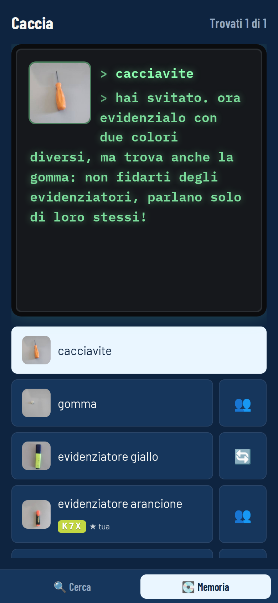
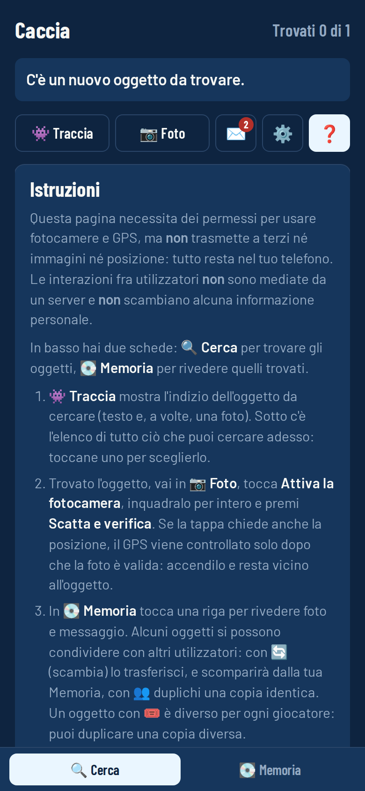
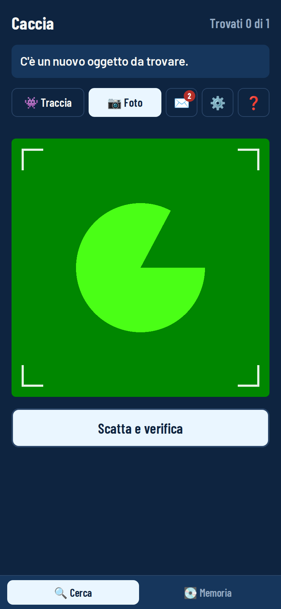
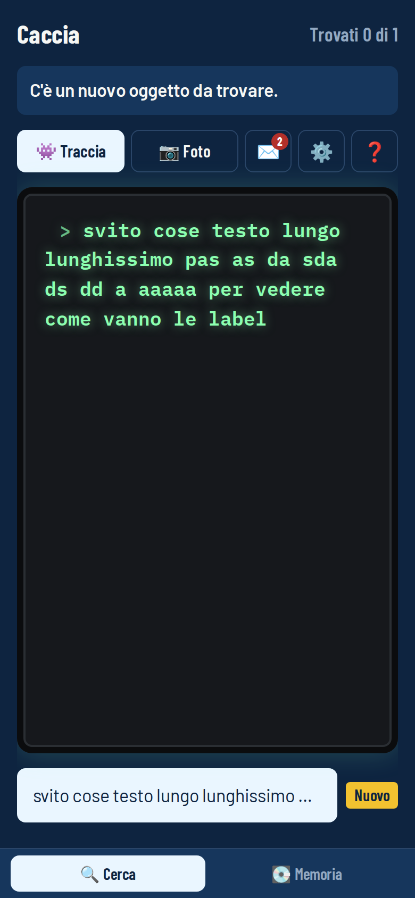
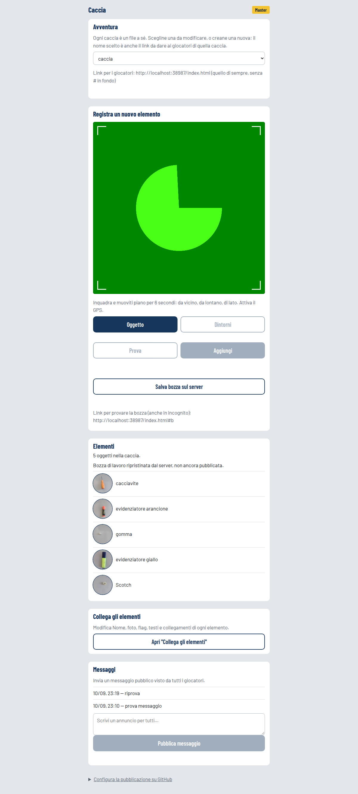
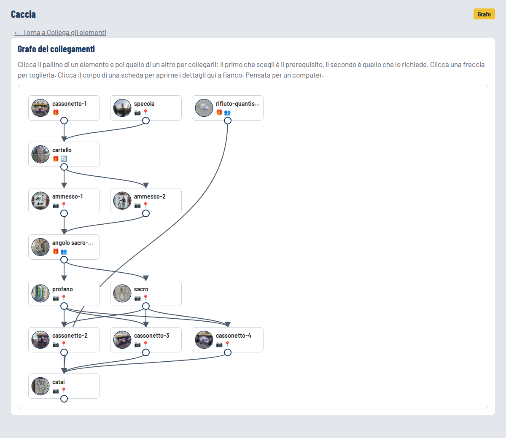
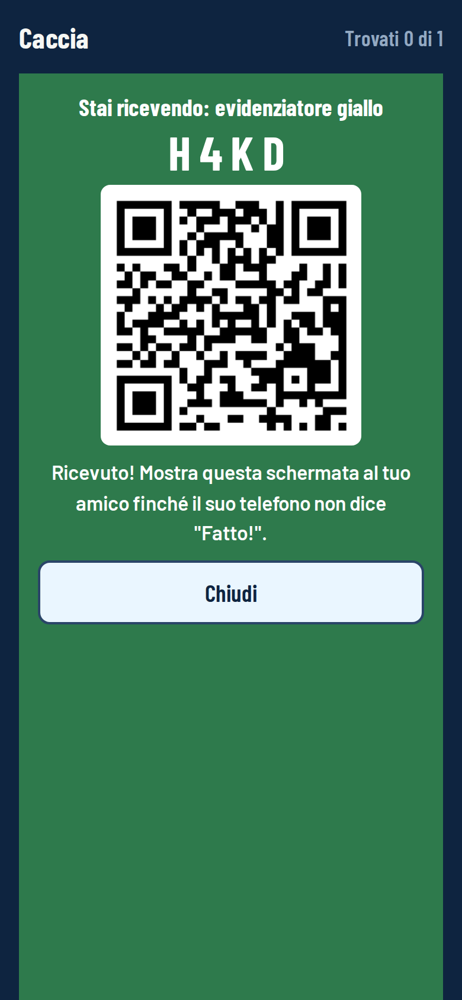
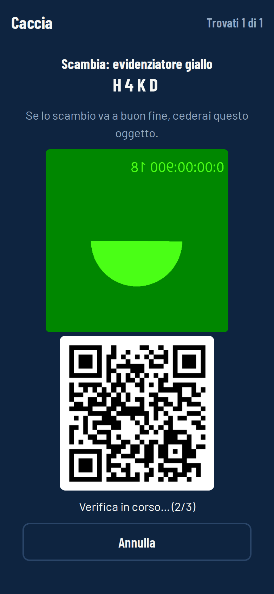

# gc — Percorsi di riconoscimento visivo sul campo / Field visual-recognition paths

🇮🇹 [Italiano](#italiano) · 🇬🇧 [English](#english)

# Italiano

**Sistema per percorsi di riconoscimento visivo sul campo, eseguito interamente nel browser.** 

## Sommario

Un curatore registra elementi fisici di un territorio; i partecipanti li individuano e li verificano con la fotocamera del proprio dispositivo. Gli elementi sono organizzati in un grafo diretto aciclico di prerequisiti, e fra dispositivi sono possibili operazioni di trasferimento e replica realizzate con un protocollo ottico fra pari, senza server. 
Non esistono identità, database né trasmissione di immagini: l'intero stato risiede sul dispositivo.

Istanza pubblica: <https://vertighel.github.io/gc/> 

Il sistema è composto da quattro strati.

1. **Verifica.** Ogni elemento è descritto da un insieme di riferimenti acquisiti sul posto dal curatore:
 - rappresentazioni vettoriali dell'elemento (positivi),
 - dell'ambiente circostante (negativi),
 - della posizione geografica.
2. La verifica del partecipante è un confronto di similarità fra la cattura dell'inquadratura e quei riferimenti, con una soglia calibrata automaticamente all'acquisizione:
 - riconoscimento di *istanze* visive, a una classe per volta, senza addestramento e senza dataset;
 - un secondo fattore opzionale è la prossimità geografica (entro un raggio dal punto registrato), controllata dopo la verifica visiva.
3. **Progressione** Gli elementi formano un *grafo diretto aciclico*:
 - gli archi sono prerequisiti in `AND`;
 - un elemento si acquisisce per *verifica* (fotocamera, più eventualmente posizione); o per *derivazione*, automaticamente, quando tutti i suoi prerequisiti sono soddisfatti.
 - A ogni elemento sono associati un testo visibile prima dell'acquisizione (traccia) e uno dopo (contenuto di sblocco);
 - il curatore dispone inoltre di un canale di annunci e può pubblicare più percorsi indipendenti dallo stesso sito.
4. **Operazioni sugli elementi derivati** Sugli elementi derivati sono definite tre operazioni:
 - *trasferimento* esclusivo (l'elemento si sposta da un dispositivo all'altro),
 - *replica* (copia identica, non esclusiva),
 - *baratto* (due trasferimenti nella stessa sessione, atomici per costruzione: nessuno dei due deve fidarsi dell'altro).
 - Ciascuna può essere *a istanze*: ogni dispositivo produce un solo token univoco dell'elemento, e i token circolano (per trasferimento, replica o baratto) come l'elemento stesso. Un arco può richiedere "almeno N istanze distinte": poiché nessun dispositivo ne produce due, il vincolo è soddisfacibile solo cooperando.
4.1. **Interazione** Le operazioni avvengono su un canale ottico bidirezionale:
 - i due dispositivi si leggono a vicenda un codice QR con le fotocamere anteriori;
 - usano un protocollo di consegna asimmetrico e senza terze parti.
5. **Compilazione del grafo e distribuzione.** Il curatore acquisisce i riferimenti sul campo, modifica il grafo (con controllo di aciclicità) e pubblica; il tutto da un pannello nello stesso file. L'applicazione è un unico file HTML su hosting statico; i dati pubblicati sono file JSON in sola lettura, scritti dal curatore tramite l'API di GitHub e scaricati dai partecipanti a ogni avvio. Lo stato di ciascun partecipante risiede esclusivamente nel suo dispositivo.

**Cosa distingue questo progetto**

- **Riconoscimento senza infrastruttura né addestramento.** Il modello (MobileNet v3 via MediaPipe) gira nel browser; ogni elemento nasce da una cattura di pochi secondi sul posto, con soglia calibrata automaticamente contro l'ambiente circostante.
- Nessuna immagine dei partecipanti lascia mai il dispositivo: la verifica avviene in locale e in rete circolano solo vettori quantizzati del curatore.
- Nessuna informazione sulla posizione lascia mai il dispositivo.
- Nessuna informazione sull'identità dell'utente è condivisa con un server.
- **Cooperazione obbligata senza identità.** L'unicità della produzione delle istanze (una stringa per dispositivo) rende alcuni elementi ottenibili solo incontrando altri utilizzatori, senza che il sistema sappia chi è chi.
- **Commit fra pari su canale ottico.** Il trasferimento fra due dispositivi è un'istanza del ["Problema dei Due Generali"](https://en.wikipedia.org/wiki/Two_Generals%27_Problem), che non ha soluzione perfetta senza arbitro. Il protocollo non finge di risolverlo: è asimmetrico (il ricevente scrive per primo, il cedente cancella solo dopo aver letto la prova) e sceglie l'errore residuo. Tecnicamente, la duplicazione resta possibile in un caso preciso, mentre la perdita è impossibile per costruzione. La prova di presenza dal vivo (*"Freshness"*) si misura con contatori locali crescenti.
- **Zero infrastruttura.** Un solo file, nessun build, nessun server applicativo: la pubblicazione è un `git push`, il "database" sono due file JSON, e il sistema funziona offline con l'ultima copia scaricata.

## Indice

- [Caso d'uso: la caccia al tesoro](#caso-duso-la-caccia-al-tesoro)
- [Come si gioca](#come-si-gioca)
- [Il master: creare una caccia](#il-master-creare-una-caccia)
- [Usare questo progetto per una caccia tua](#usare-questo-progetto-per-una-caccia-tua)
- [Struttura del progetto](#struttura-del-progetto)
  - [Architettura](#architettura)
  - [Modello dati](#modello-dati)
  - [Scambio senza server](#scambio-senza-server)
  - [Convenzioni dell'interfaccia](#convenzioni-dellinterfaccia)
- [Sviluppo e test](#sviluppo-e-test)
- [Limiti noti e roadmap](#limiti-noti-e-roadmap)

## Caso d'uso: la caccia al tesoro

Il master gira per la città, fotografa oggetti reali (portoni, maniglie, orologi, cartelli…) e li collega fra loro in una trama. 
I giocatori aprono un indirizzo web sul telefono, leggono l'indizio, cercano l'oggetto e lo inquadrano: il riconoscimento avviene sul telefono stesso, confrontando *embedding* calcolati nel browser — nessuna foto lascia mai il dispositivo. Una tappa può anche richiedere di trovarsi entro 100 m dal punto in cui il master ha registrato l'oggetto (GPS, controllato solo dopo che la foto è valida).

Trovare un oggetto può sbloccare dei *regali*: elementi che si ottengono da soli quando i loro prerequisiti sono soddisfatti. Un regalo può essere **scambiabile** (passa a un amico, chi lo cede lo perde), **duplicabile** (l'amico riceve una copia) o **barattabile** (si scambia alla pari con un altro regalo barattabile, nello stesso incontro); ognuno di questi può inoltre essere **a istanze** (ogni telefono ne produce una copia diversa, e un altro elemento può richiederne "almeno N diverse": l'unico modo per averle è incontrare altri giocatori). Il passaggio avviene telefono-a-telefono, leggendosi a vicenda un QR con le fotocamere anteriori, senza server. Il master può inoltre inviare messaggi a tutti i giocatori.

## Come si gioca

Le stesse istruzioni si leggono nel gioco toccando ❓.

Questa pagina necessita dei permessi per usare fotocamere e GPS, ma **non** trasmette a terzi né immagini né posizione: tutto resta nel tuo telefono. Le interazioni fra utilizzatori **non** sono mediate da un server e **non** scambiano alcuna informazione personale.

In basso hai due schede: **🔍 Cerca** per trovare gli oggetti, **💽 Memoria** per rivedere quelli trovati.

1. **👾 Traccia** mostra l'indizio dell'oggetto da cercare (testo e, a volte, una foto). Sotto c'è l'elenco di tutto ciò che puoi cercare adesso: toccane uno per sceglierlo.
2. Trovato l'oggetto, vai in **📷 Foto**, tocca **Attiva la fotocamera**, inquadralo per intero e premi **Scatta e verifica**. Se la tappa chiede anche la posizione, il GPS viene controllato solo dopo che la foto è valida: accendilo e resta vicino all'oggetto.
3. In **💽 Memoria** tocca una riga per rivedere foto e messaggio. Alcuni oggetti si possono passare ad altri utilizzatori: con **➡️** (scambia) lo trasferisci, e scomparirà dalla tua Memoria; con **👥** duplichi una copia identica; con **🤝** lo baratti alla pari con un oggetto 🤝 dell'altro. Un oggetto con 🎟️ è diverso per ogni giocatore (un sigillo con un codice): ne passi una copia, e un altro elemento può chiederne "almeno N diversi".
4. Per passarlo: tu premi ➡️ o 👥 in Memoria; chi riceve apre **📷 Foto**, attiva la fotocamera e inquadra il tuo schermo. Poi mettete i telefoni schermo contro schermo: le fotocamere anteriori si leggono a vicenda. Aspettate **Fatto!**: chi riceve vede una schermata verde con un codice e la tiene in vista finché l'altro telefono non ha finito. Se il tuo telefono dice «Non ho letto la conferma», guarda l'altro schermo: rispondi **Sì** solo se è verde e mostra lo stesso codice.
5. Per riceverlo: apri **📷 Foto**, attiva la fotocamera e inquadra il QR nell'altro schermo. Dopo pochi istanti si aprirà la camera anteriore. Metti i telefoni schermo contro schermo: le fotocamere anteriori si leggono a vicenda. Aspettate **Fatto!**: chi riceve vede una schermata verde con un codice e la tiene in vista finché l'altro telefono non ha finito. Se il tuo telefono dice «Non ho letto la conferma», guarda l'altro schermo: rispondi **Sì** solo se è verde e mostra lo stesso codice.
6. Per barattare: entrambi premete **🤝** in Memoria sull'oggetto che offrite, poi mettete i telefoni schermo contro schermo. Ognuno riceve l'oggetto dell'altro e cede il proprio, nello stesso momento: nessuno dei due deve fidarsi. Se avete già l'oggetto offerto, non c'è niente da barattare e il telefono lo dice. Anche qui vale la schermata verde con il codice.
7. **✉️** sono i messaggi del master: si scaricano a ogni apertura dell'app.
8. **⚙️** sono le impostazioni: **Prepara il telefono** chiede fotocamera e posizione e sblocca i suoni una volta sola, prima di partire; **Suoni** accende i segnali durante uno scambio (un bip grave ogni mezzo secondo = fermo, tre note che salgono = sta leggendo, un "plin" = fatto); qui si legge anche la versione; **Cambia caccia** torna alla scelta della caccia; **Ricomincia la caccia** cancella la Memoria e i progressi di questa caccia su questo telefono.

## Il master: creare una caccia

Il pannello del master è lo stesso `index.html` aperto con `#master` in fondo all'indirizzo: una sola pagina con cinque schede — 📷 **Foto** (`#master`), ✏️ **Edita** (`#master-edita`; `#master-collega` resta come alias), 🕸️ **Grafico** (`#master-grafo`), 📣 **Messaggi** (`#master-messaggi`) e ⚙️ (`#master-impostazioni`) — sotto una testata fissa uguale per tutte (il menu **Avventura** delle cacce, le righe di stato della copia di lavoro, la barra delle schede) e sopra un piè fisso, anche sul computer, con i tre bottoni **Bozza**, **Pubblica** e **Prova qui**.

**Avventura e Foto (`#master`).** Nella testata, il menu delle cacce: la prima voce "+ Nuova caccia" chiede un nome, che diventa lo *slug* (minuscole, spazi e simboli trasformati in `-`) e quindi il nome del file e il link da mandare ai giocatori; poi "caccia" (quella di sempre, senza `#` nel link) e ogni caccia con nome elencata in `cacce.json`; in fondo, marcate "(bozza, non pubblicata)", quelle che hanno solo una bozza sul server (`lavori.json`). Sotto, "Registra un nuovo elemento": si attiva la fotocamera e si registra un oggetto sul posto, sempre con la stessa sequenza — **Oggetto** (20 fotogrammi mentre ci si muove per circa 6 secondi, più uno scatto compresso per la miniatura), **Dintorni** (10 fotogrammi dell'ambiente intorno, usati come negativi), la posizione GPS del master in quel momento. La soglia di riconoscimento si calcola da sola (`calibrate()`) e un messaggio avvisa se l'oggetto è troppo simile ai dintorni. **Prova** verifica subito il riconoscimento con la fotocamera; **Aggiungi** mette il nodo nella copia di lavoro (nome di default "Oggetto-N"), senza pubblicare. Si può anche fare il contrario, **prima il grafo e poi le foto**: "Aggiungi un segnaposto (senza foto)" crea un nodo vuoto ("Elemento-N"), anche dal computer, da nominare e collegare come gli altri; sul campo si tocca l'elemento nella lista **Elementi** (i segnaposto stanno in testa, con `📷❓`) e la stessa sequenza Oggetto → Dintorni → Aggiungi scrive la foto dentro quel nodo — lo stesso gesto su un elemento già fotografato sostituisce la foto. Un regalo può restare senza foto; un elemento da validare senza foto blocca "Pubblica" e "Prova qui". Le miniature dell'elenco si ingrandiscono in una lightbox.

**Edita (`#master-edita`).** Pensata per un computer. Una scheda per nodo con: foto, nome modificabile, le tre spunte **Thumb** (la foto fa da indizio mentre l'elemento è ancora da trovare), **Validare** (serve la foto del giocatore per possederlo; spenta, l'elemento diventa un regalo che si ottiene da solo quando i prerequisiti sono soddisfatti) e **Posizione** (in più alla foto, il giocatore deve essere entro 100 m; spuntarla accende anche Validare); solo con Validare acceso, la tendina **Bivio** (1–9: gli elementi con lo stesso numero sono alternativi, il primo fotografato esclude gli altri e il loro ramo). Solo sui regali compare il **modo**, su due assi indipendenti: come circola — 🎁 Libero, ➡️ Scambiabile, 👥 Duplicabile, 🤝 Barattabile — e la spunta 🎟️ **A istanze**, disponibile per i tre modi che circolano. Poi i due testi, **Indizio** (visibile prima, mentre lo si cerca) e **Messaggio** (visibile alla schermata di sblocco e poi in Memoria), e due elenchi di spunte verso ogni altro nodo: **Richiede** (in AND; se il prerequisito è a istanze compare il campo "almeno N") e **Richiede almeno uno di** (in OR, per far convergere più rami sullo stesso elemento). "Rimuovi" è bloccato se un altro nodo lo richiede ancora.

**Grafico (`#master-grafo`).** Gli stessi collegamenti disegnati: layout automatico verticale per livello di dipendenza, un'icona per nodo (📷 da validare, 📍 con posizione, 🎁 regalo più l'icona del modo, `×N` sulle frecce a istanze). Si collega cliccando il pallino di un nodo e poi quello di un altro (il primo è il prerequisito), si scollega cliccando una freccia, si apre la stessa scheda di "Edita" cliccando il corpo di un nodo. Se c'è un ciclo il grafo non si disegna e un messaggio elenca i nodi coinvolti.

**Messaggi (`#master-messaggi`) e ⚙️ (`#master-impostazioni`).** Un annuncio per tutti i giocatori, scritto in `messaggi.json`; in ⚙️ i link da mandare ai giocatori e quello della bozza, e la configurazione di GitHub (un pallino rosso sull'icona finché manca).

**Bozza e pubblicazione (il piè).** La copia di lavoro si salva in due modi: in automatico nel `localStorage` del telefono del master a ogni modifica (chiave `m-lavoro`), e sul server premendo **Bozza**, che scrive `lavoro.json` (o `lavoro-<slug>.json`). Quest'ultimo file non è mai letto dal giocatore normale, ma si può provare da qualunque browser col link `#b` (o `#b-<slug>`); al primo salvataggio di una caccia con nome lo slug finisce in `lavori.json`, così da un altro dispositivo la si ritrova nel menu senza doverla ricreare (e "+ Nuova caccia" con lo stesso nome viene rifiutata: niente rischio di sovrascrivere la bozza con una vuota). All'apertura il pannello ricarica la copia di lavoro scegliendo la più recente per data fra bozza locale, bozza sul server e caccia pubblicata (vuota se non c'è nulla); modifiche locali mai salvate non vengono scartate senza chiedere. Solo **Pubblica** scrive `caccia.json` (o `caccia-<slug>.json`) — dopo un controllo che i collegamenti non formino un ciclo, che nessun elemento stia nello stesso bivio di un proprio antenato e che nessun elemento da validare sia senza foto — e alla prima pubblicazione di una caccia con nome la aggiunge a `cacce.json`. **Prova qui** apre il giocatore su questo stesso telefono in uno spazio separato, segnalato da una striscia gialla, senza toccare la caccia pubblicata.

Tutte le scritture passano dall'**API REST di GitHub** (`ghPutFile()`: `GET` per lo sha corrente, `PUT` per scrivere, un tentativo in più su conflitto 409). Il pannello "Configura la pubblicazione su GitHub" salva utente, repository, ramo e un token *fine-grained* con permesso "Contents: Read and write" limitato a questo repository. Il token resta solo nel `localStorage` di quel telefono. I giocatori vedono il file aggiornato entro circa un minuto.

**Più cacce.** Ogni caccia è un file a sé: `caccia.json` per quella di sempre, `caccia-<slug>.json` per le altre, elencate in `cacce.json`. Il giocatore che apre il link senza `#` sceglie da una lista e la scelta viene ricordata; un link diretto `#c-<slug>` salta la scelta e va dritto a quella caccia. I messaggi (`messaggi.json`) sono invece globali, condivisi da tutte le cacce.

## Usare questo progetto per una caccia tua

Non c'è nulla da installare né da configurare nel codice: basta una copia del repository su GitHub Pages.

1. **Copia il repository** sul tuo account: "Use this template" (copia pulita) o un fork. Deve restare **pubblico**: GitHub Pages sui repository privati richiede un piano a pagamento.
2. **Attiva GitHub Pages**: Settings → Pages → "Deploy from a branch", ramo `main`, cartella `/` (root). Dopo un minuto il gioco risponde a `https://<utente>.github.io/<repository>/`.
3. **Togli le cacce di esempio** che arrivano con la copia: cancella `caccia-*.json` e `lavoro-*.json`, e svuota `cacce.json`, `lavori.json` e `messaggi.json` lasciando `[]`. `caccia.json` (la caccia di sempre) la sostituirai pubblicando la tua.
4. **Configura il master**: apri `…/#master` sul telefono e, in "Configura la pubblicazione su GitHub", inserisci proprietario, repository, ramo e un token *fine-grained* (Settings → Developer settings → Personal access tokens) con il solo permesso "Contents: Read and write" limitato a quel repository. Il token resta nel `localStorage` di quel telefono: non finisce mai in un file.

Da lì in poi vale tutto ciò che è scritto sopra: registri gli oggetti sul posto, li colleghi da un computer, provi con `#b`, pubblichi. Il riconoscimento, le librerie QR e il modello MediaPipe si caricano da CDN pubbliche, quindi non c'è altro da ospitare.

## Struttura del progetto

| File | Cosa contiene |
|---|---|
| [`index.html`](index.html) | Tutto il gioco: CSS, HTML (giocatore, scelta della caccia, master, Collega, Grafo, `<template>`) e il modulo JS. |
| `caccia.json`, `caccia-<slug>.json` | Le cacce pubblicate, formato `caccia-3`. Scritte dal master via API GitHub, lette dai giocatori con `fetch()`. |
| `lavoro.json`, `lavoro-<slug>.json` | Bozze di lavoro del master salvate sul server. Mai lette dal giocatore normale; provabili col link `#b`/`#b-<slug>`. |
| `cacce.json` | Elenco degli slug delle cacce con nome (quella di sempre non ci compare mai). |
| `lavori.json` | Elenco degli slug delle cacce con nome che hanno una bozza sul server: letto solo dal pannello master, così una caccia iniziata sul telefono si ritrova dal computer prima di pubblicarla. |
| `messaggi.json` | Annunci del master, in ordine di pubblicazione, uguali per tutte le cacce. |
| `img/` | Gli screenshot di questo README. |
| [`tests/`](tests/) | Test Playwright: `scambio.test.mjs` (protocollo di scambio), `sincronizzazione.test.mjs` (telefono e computer del master che si passano la copia di lavoro), `bivio.test.mjs` (bivi e convergenza) e `segnaposto.test.mjs` (grafo prima, foto dopo). |

### Architettura

- **Un solo file HTML**, senza framework e senza build: si pubblica con un `git push` su GitHub Pages. Le uniche librerie esterne si caricano da CDN con `import()` dinamico, solo quando servono.
- **I JSON sono il database, in sola lettura.** I giocatori li scaricano con `fetch()` (senza cache) a ogni apertura; solo il master li scrive, tramite l'API di GitHub. Non c'è nessun database vero.
- **Lo stato del giocatore vive nel `localStorage`** del suo telefono: la caccia scaricata, gli elementi posseduti, il bottino, i messaggi letti, gli elementi ceduti e le istanze prodotte, con chiavi separate per caccia (`gioco`/`stato`, `gioco:<slug>`/`stato:<slug>`). Funziona offline con l'ultima copia scaricata.
- **Il riconoscimento immagini è interamente nel browser.** `index.html` usa [MediaPipe Tasks Vision](https://www.npmjs.com/package/@mediapipe/tasks-vision) (`@mediapipe/tasks-vision@1.0.1`, classe `ImageEmbedder`) con il modello `mobilenet_v3_small` (float32) scaricato dal repository dei modelli MediaPipe; prova prima il delegato GPU e ripiega su CPU. Ogni fotogramma diventa un vettore normalizzato (1024 dimensioni) e si confronta per prodotto scalare con i vettori dell'oggetto (`pos`) e dei dintorni (`neg`) registrati dal master; vince il migliore di 5 fotogrammi ravvicinati, valido se supera la soglia calcolata alla registrazione ed è più simile all'oggetto che ai dintorni. In `caccia.json` i vettori sono compressi a 8 bit (`pack()`/`unpack()`): nessuna foto dei giocatori lascia mai il telefono, e da un embedding non si ricostruisce un'immagine.
- **QR per lo scambio**: lettura con [`jsqr`](https://www.npmjs.com/package/jsqr) 1.4.0, generazione con [`qrcode`](https://www.npmjs.com/package/qrcode) 1.5.4, entrambi caricati da CDN solo quando si apre l'interfaccia di scambio.

### Modello dati

Formato `caccia-3`: un solo tipo di nodo. La foto di un nodo viene sempre dalla cattura sul campo (foto dell'oggetto, foto dei dintorni, posizione GPS: tutte e tre insieme), ma il nodo può nascere prima, vuoto (un *segnaposto*: `pos` vuoto, `immagine`/`soglia`/`luogo` a `null`), e si comporta in un modo o nell'altro solo in base a tre flag booleani:

- `daValidare` — `true`: serve foto e riconoscimento per possederlo; `false`: è un regalo, posseduto da solo appena i suoi `richiede` sono soddisfatti.
- `richiedePosizione` — in più alla foto, il giocatore deve essere entro `luogo.raggio` (100 m). Implica `daValidare: true`.
- `conThumb` — la foto fa da indizio mentre il nodo è ancora da trovare. Una volta posseduto, la foto si vede sempre.

`richiede` è la lista dei prerequisiti (in AND); `richiedeUno`, facoltativo, ne aggiunge un gruppo in OR ("almeno uno di"). `bivio` (1–9, solo con `daValidare: true`) rende alternativi i nodi con lo stesso numero: il primo validato blocca gli altri, che spariscono da Traccia insieme a ciò che dipende solo da loro; un regalo condivisibile ricevuto da un altro giocatore riapre il suo ramo da lì in poi. Sui regali, il modo — uno solo fra `scambiabile` / `duplicabile` / `barattabile` — e, indipendente, `istanze`; su chi richiede un nodo a istanze, `istanzeRichieste: { "<id>": N }` per chiedere "almeno N istanze diverse". Un'istanza è un id casuale a tre caratteri lettera-cifra-lettera (es. `K7X`), prodotto una sola volta per telefono. `testo` (l'indizio, prima) e `messaggio` (dopo lo sblocco) sono sempre riferiti al nodo stesso. Prima di pubblicare, `trovaCiclo()` controlla che i collegamenti non formino un ciclo, `biviImpossibili()` che nessun nodo stia nello stesso bivio di un proprio antenato ed `elementiSenzaFoto()` che nessun nodo da validare sia ancora un segnaposto. Se il master ripubblica con lo stesso `formato`, i progressi dei giocatori restano e i nuovi nodi si aggiungono; un `formato` diverso azzera tutto.

### Scambio senza server

Un regalo `scambiabile` o `duplicabile` (e ogni istanza di un regalo a istanze) passa da un telefono all'altro con un handshake dal vivo: i due telefoni si mettono schermo contro schermo e ognuno legge, con la fotocamera anteriore, il QR che l'altro mostra e ridisegna alcune volte al secondo. Il QR contiene solo `gc1:tipo:sessionId:nodo:seq:ack:mioId:istanza` (44 byte al massimo, versione QR 3, così i moduli restano grandi e leggibili). Le prime quattro lettere del `sessionId` sono il codice mostrato grande su entrambi gli schermi.

Il problema di fondo — due dispositivi che devono accordarsi su un trasferimento scambiandosi messaggi che possono perdersi, senza un terzo che ricordi l'esito — è il **Problema dei Due Generali**, che non ha soluzione perfetta. Il gioco non lo risolve: sceglie quale dei due errori possibili resta ammesso. Il **protocollo è asimmetrico**: il ricevente scrive per primo, appena ha letto `QR_K` (3) fotogrammi crescenti del cedente e sa di essere stato letto almeno una volta, e mostra una schermata verde persistente col codice; il cedente cancella l'oggetto **solo** dopo aver letto quel QR "fatto" (e a quel punto diventa verde anche lui: è l'unico dei due ad avere la certezza), oppure dopo che il giocatore ha guardato con i propri occhi lo schermo verde dell'amico e confrontato il codice (domanda manuale, che compare dopo 30 s dal tocco e 10 s da quando l'amico può aver scritto, comunque entro 60 s). Così la **perdita** (cancellato da chi cede, mai arrivato a chi riceve) è impossibile per costruzione; l'unico errore residuo, accettato, è la **duplicazione**, e solo se il cedente risponde "No" mentre l'amico è già verde. La freschezza si misura con contatori locali crescenti, mai confrontando gli orologi dei due telefoni; un QR stampato non supera mai la soglia, perché non può rispondere in tempo reale. Chi cede un nodo lo vede segnato per sempre in `ceduti`, così la chiusura automatica dei regali non glielo restituisce alla foto successiva; chi cede un'istanza perde solo quella riga, e non può coniarne un'altra (`prodotti`).

Il **baratto** (🤝) è lo stesso protocollo girato due volte nella stessa sessione, ed esiste perché fra due giocatori che non collaborano lo scambio a senso unico non parte mai: il primo che cede si espone. Entrambi aprono da Memoria e ciascuno offre il proprio nodo (`gc1:b:mioId:nodo:seq:ack:istanza`, 37 byte; nessun `sessionId` condiviso, ci si aggancia al primo amico letto e il codice a 4 lettere si deriva dai due id). L'**acquisizione** dell'oggetto dell'altro è simmetrica e non distruttiva, alla stessa condizione del ricevente; la **cessione** del proprio avviene solo dopo aver acquisito il suo *e* aver letto nel suo QR che lui ha acquisito il mio (lettera `B`; `C` = ho anche ceduto). Stessa classe di errore residuo: mai perdita, al più duplicazione se la sessione si interrompe dopo un'acquisizione. Due dettagli contano: il QR non si congela all'acquisizione (il `seq` continua a salire finché non si cede, altrimenti l'altro può non arrivare mai ai suoi fotogrammi crescenti), e se l'oggetto offerto è già mio non acquisisco (lettera `x`), così la regola di cessione non mi fa perdere il mio per niente.

### Convenzioni dell'interfaccia

- **HTML nativo, il JS lo riempie.** Righe, schede, festa di sblocco, messaggi sono `<template>` in fondo alla pagina, clonati con `clona(id)`. I testi con più varianti (titoli dello scambio, fine caccia) sono tutti scritti in HTML e il CSS ne mostra uno. `<dialog>` per la lightbox, `::before` per gli elenchi vuoti, `:has()` per le dipendenze fra campi.
- **Lo stato visibile è un attributo `data-*`**, mai una lista di `hidden` accesi e spenti a mano: `body[data-view]` (`player`, `chooser`, `master`, `master-edita`, `master-grafo`, `master-messaggi`, `master-impostazioni`), `#view-player[data-tab][data-sub][data-stato]`, `#p-scambio[data-ruolo][data-tipo][data-fase][data-n]`, `.scheda-nodo[data-validare]`. Da `data-view` il CSS deriva anche tema scuro, larghezza e schermo pieno.
- **I clic sono azioni dichiarate.** Ogni elemento cliccabile porta `data-azione="nome"` (più i dati che servono in altri `data-*`), la funzione con lo stesso nome sta in `AZIONI`, e un unico listener delegato la chiama. Nessun `onclick =` nel file.
- **Nessun gancio di test nel file vero**: i test copiano `index.html` e iniettano `window.__debug` solo nella copia.

## Sviluppo e test

[`tests/scambio.test.mjs`](tests/scambio.test.mjs) fa esattamente questo per il protocollo di scambio: due pagine Playwright fanno da telefoni, lettura e generazione del QR sono sostituite da stub, i giri del ciclo si eseguono uno alla volta. Verifica l'asimmetria (il ricevente scrive per primo), la domanda manuale del cedente e i suoi tempi, "Annulla", "duplica", i timeout, e i regali a istanze (produzione unica, produzione dopo ricezione, rifiuto della stessa istanza, copie di copie, chiusura "almeno ×2", messaggio "Ti manca"). **Non** prova la convergenza ottica reale: quella si vede solo con due telefoni veri. [`tests/sincronizzazione.test.mjs`](tests/sincronizzazione.test.mjs) fa lo stesso per il lato master: due dispositivi (telefono e computer) che si passano la copia di lavoro con "Bozza" e "Pubblica", con un'API di GitHub finta che scrive davvero i file nella cartella servita, compresa una caccia mai pubblicata ritrovata dal computer tramite `lavori.json`. [`tests/bivio.test.mjs`](tests/bivio.test.mjs) copre bivi e convergenza: alternativa bloccata dopo la prima foto, ramo morto, contatore "Trovati N di M" sui soli raggiungibili, ramo riaperto da un regalo ricevuto, controllo di pubblicazione. [`tests/segnaposto.test.mjs`](tests/segnaposto.test.mjs) copre "grafo prima, foto dopo": segnaposto creati senza fotocamera, elemento della lista scelto come bersaglio, cattura che atterra dentro il nodo (nome e collegamenti intatti), foto rifatta, pubblicazione e prova bloccate finché un elemento da validare è senza foto, giocatore che scatta su un segnaposto. Si lanciano con `node tests/<nome>.test.mjs` da una cartella dove `playwright` (con Chromium) è installato.

Sul campo, `?diag` nell'indirizzo (es. `…/gc/?diag#c-casa`) aggiunge alla schermata di scambio una riga di diagnostica: giri del ciclo, dimensione del video, letture, ack, amico agganciato e l'ultimo QR letto con il motivo dello scarto.

Il banner di avvio mostra `Avvio del gioco… (versione N)` finché il JS non è partito; la stessa versione resta leggibile in ⚙️ Impostazioni. `N` si incrementa a ogni modifica pubblicata ed è il modo più rapido per capire, guardando il telefono, se gira l'ultima versione o una vecchia rimasta in cache.

## Limiti noti e roadmap

- **I JSON sono pubblici.** Chiunque conosca l'indirizzo può leggere `caccia.json`: nomi, indizi, coordinate. Accettato per scelta, con meno di dieci amici; per nasconderli servirebbe un database con indizi cifrati.
- **Nessuna identità dei giocatori.** Ogni telefono è anonimo; progressi e bottino vivono solo nel suo `localStorage`. Rimandata di proposito, è il prerequisito di tutto il resto.
- **Nessun database.** Tutto ciò che richiede scritture da più telefoni — log di chi ha trovato cosa visibile al master, un contatore condiviso — è rimandato a un database vero (quasi certamente Supabase), senza cambiare hosting.
- **Scarsità rimandata.** Un regalo duplicabile si condivide un numero illimitato di volte: un tetto condiviso (`scorta`) richiede un'operazione atomica su un database.
- Il repository **deve restare pubblico**: GitHub Pages sui repository privati richiede un piano a pagamento.

d Netlify Drop (worked, but inconvenient for repeated publishing without a CLI). Also removed on request: an Instagram share button on the end-of-hunt screen.

